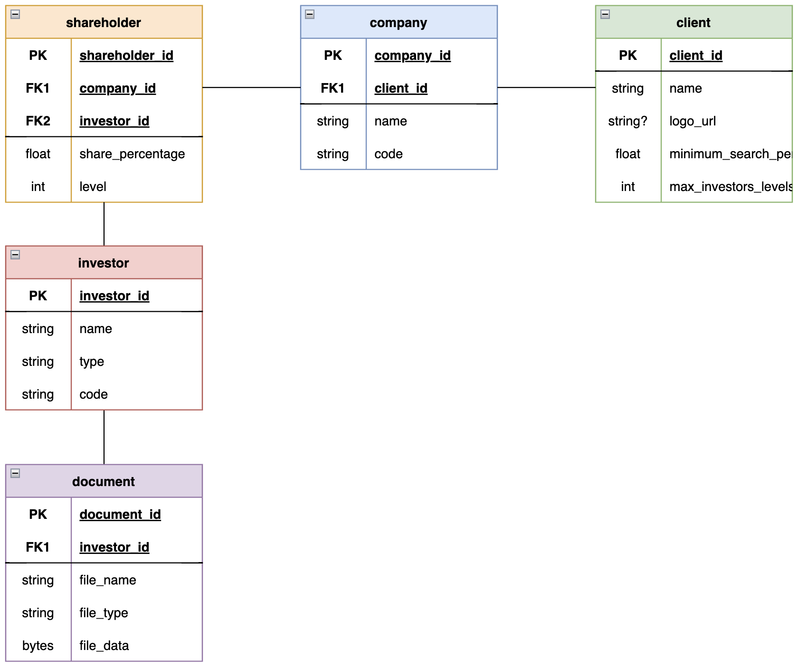
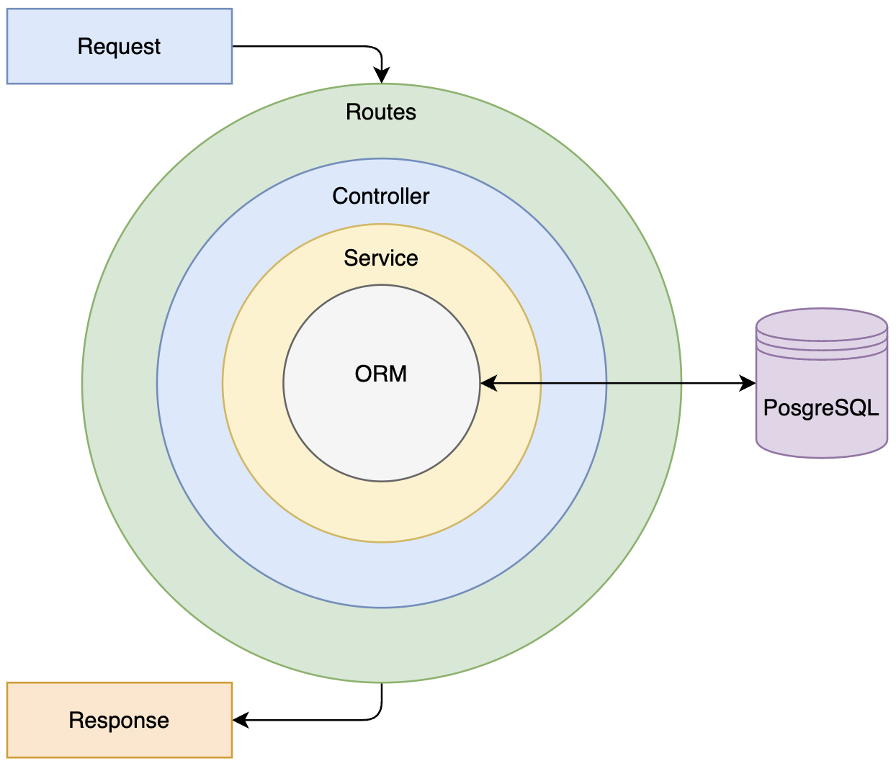

# Documentation | Back End

**Author:** Pablo Beltran  
**Start Date:** July 8th, 2024  
**End Date:** July 17th, 2024  

## Overview

The Trebol web application is designed to manage and register companies and their real owners for different clients (such as banks or financial institutions). The system tracks the hierarchical structure of investors and determines the real owners based on client-specific criteria.

## Entity Relationship Diagram

This ERD and its corresponding documentation provide a clear and structured way to manage companies, investors, and their relationships for different clients. The system tracks ownership hierarchies and determines real owners based on client-specific criteria, ensuring accurate and efficient data management.

## Project Structure

The project structure follows a common pattern to ensure modularity, maintainability, and separation of concerns. Each layer has a specific responsibility, and they interact with each other to handle HTTP requests, perform business logic, and interact with the database.

- **Routes:** Define the API endpoints and map them to the appropriate controllers.

- **Controllers:** Handle incoming HTTP requests, validate input, and delegate processing to the services.

- **Services:** Contain the business logic and interact with the Prisma client to perform database operations.

- **Prisma:** Acts as the ORM layer, providing a type-safe interface to interact with the PostgreSQL database.

